# Esame Programmazione Java

Progetto per l'esame di Programmazione Java, Ingegneria Informatica - Università di Pisa.

La repository contiene il materiale prodotto durante lo sviluppo del progetto per l'esame di Programmazione Java.

Il contenuto e' ordinato secondo le fasi di lavoro imposte dalle direttive dell'esame, e ad ogni fase e' stata dedicata una directory.
Infine e' presente la cartella NetbeansProjects che contiene i progetti sviluppati con Netbeans.
Sono presenti anche le cartelle "Script bat", contenente uno script bat e i file necessari per compilare il progetto su macchine Windows (si dovra' modificare la locazione dei comandi java, javac e jar perche' funzioni su macchine differenti), e "Script sql", contenente lo script SQL necessario per ricreare il database utilizzato dal progetto.

Di seguito alcune screens dell'applicativo:

 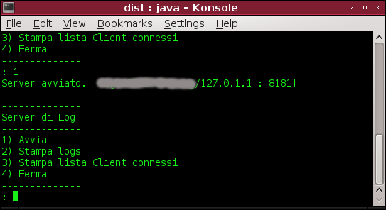 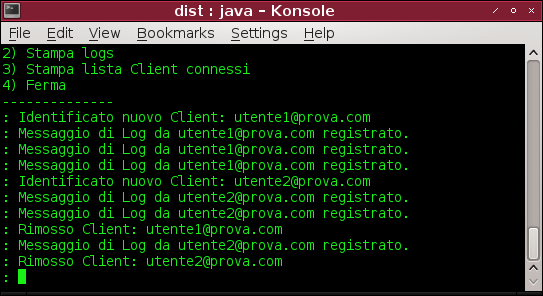 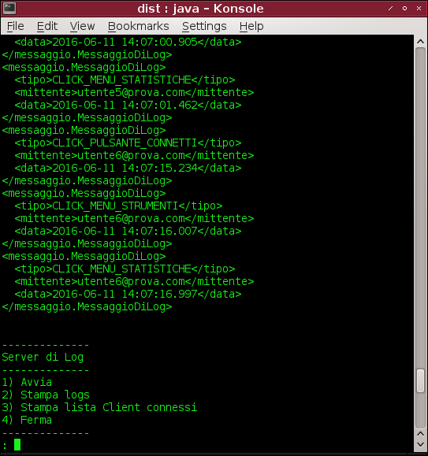 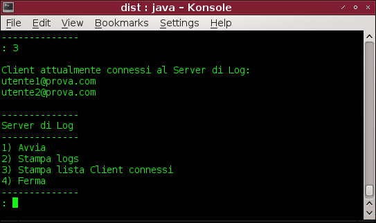 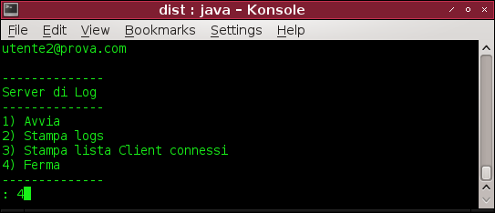 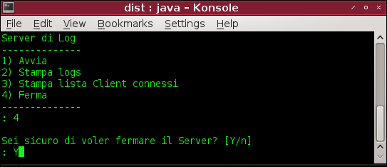

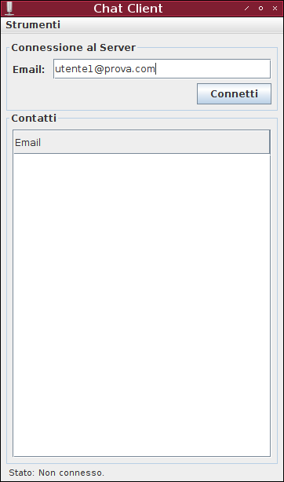 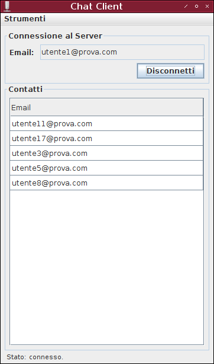 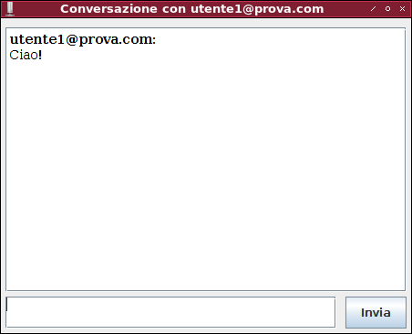 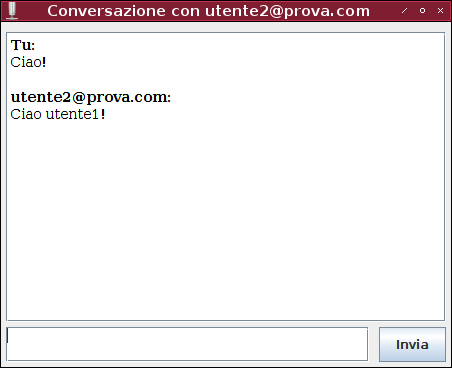 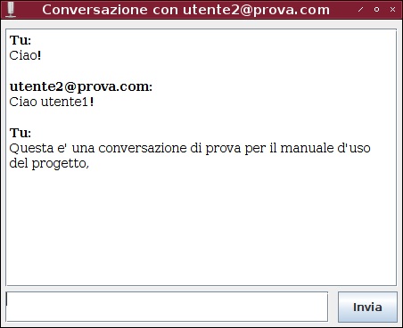 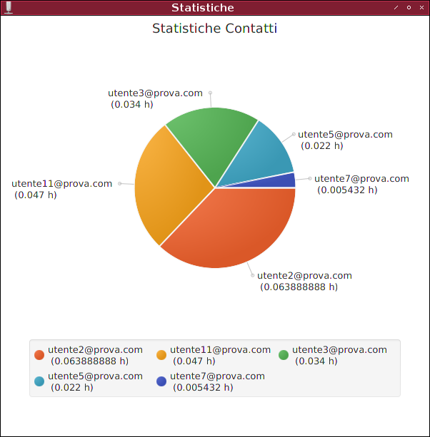

--

Rambod Rahmani <<rambodrahmani@autistici.org>>
